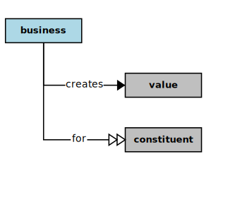

## Business



In the context of this [Model](model.md), a [Business](business.md)

```
<i>creates</i>  a [value](value.md) for  some constituents
```

### Discussion


<h3 align="center"><b>&sect; &sect; &sect;</b></h3>
