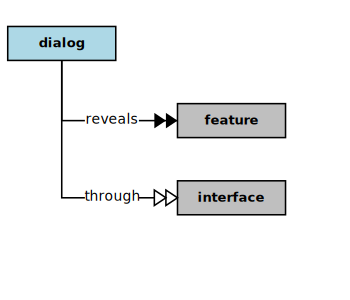

## Dialog

<div  style="float: right; margin: 20px">

</div>

In the context of this [Model](model.md), a [Dialog](dialog.md)

```
<i>reveals</i>  some [features](feature.md) through  some [interfaces](interface.md)
```

### Discussion


<h3 align="center"><b>&sect; &sect; &sect;</b></h3>
