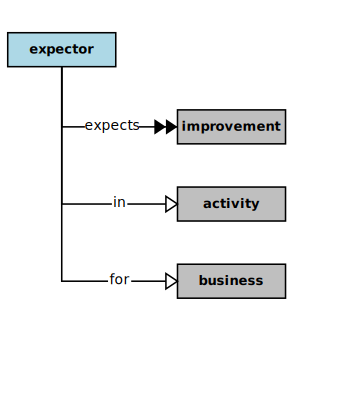

## Expector



In the context of this [Model](model.md), an [Expector](expector.md)

```
<i>expects</i>  some [improvements](improvement.md) in  an [activity](activity.md) for  a [business](business.md)
<i>performs</i>  some [activities](activity.md) for  a [business](business.md)
<i>uses</i>  some [features](feature.md) of  a [solution](solution.md)
<i>requests</i>  some actions of  some [components](component.md) through  some [dialogs](dialog.md)
<i>requests</i>  some [values](value.md) from  some [components](component.md) through  some [dialogs](dialog.md)
<i>serves</i>  a [business](business.md) as  a [source](source.md) of  some [features](feature.md)
```

### Discussion

There are potentially several kinds of [expectors](expector.md).
An [expector](expector.md) generally expects a software [solution](solution.md) to simplify, permit, and improve the conduct of some [business](business.md) [activity](activity.md)(s).
In some cases, a [business](business.md) [activity](activity.md) might not even be allowed, or might not be affordable without a software [solution](solution.md)
to automate some the associated processes, or to monitor them and collect measurements.


<h3 align="center"><b>&sect; &sect; &sect;</b></h3>
