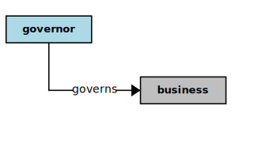

## Governor



In the context of this [Model](model.md), a [Governor](governor.md)

```
<i>governs</i>  a [business](business.md)
<i>serves</i>  a [business](business.md) as  a [source](source.md) of  a [vision](vision.md),  a [mission](mission.md),  some [values](value.md)
```

### Discussion

There are several kinds of [governors](governor.md). A [governor](governor.md) guides and governs a [business](business.md), providing direction and scope,
and establishing boundaries and limits.


<h3 align="center"><b>&sect; &sect; &sect;</b></h3>
