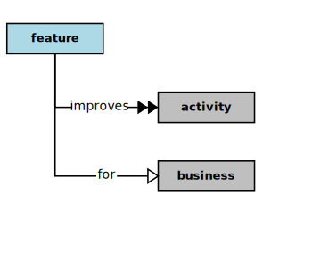

## Improvement

<div  style="float: right; margin: 20px"></div>

In the context of this [Model](model.md), an [Improvement](improvement.md)

```
 a [feature](feature.md) <i>improves</i>  some [activities](activity.md) for  a [business](business.md)
```

### Discussion


Business [activities](activity.md) are most <a href="value.html">valuable</a> when they are aligned with specific and clearly formulated objectives.
Each [business](business.md) needs to have [mission](mission.md) and [vision](vision.md) statements that focus on the ends the [business](business.md) intends to effect in the world.
To effect these ends, a [business](business.md) has processes (a series of [activities](activity.md)), especially processes that operate on information
(and so need information systems).
Business information systems are products (with <a href="../../papers/rhetoric/quality/alignment.htm#business.qualities">qualities</a>) that provide services (which also have <a href="../../papers/rhetoric/quality/alignment.htm#business.qualities">qualities</a>).
Information services support and improve [business](business.md) operations by streamlining [business](business.md) processes
(which have their own <a href="../../papers/rhetoric/quality/alignment.htm#business.qualities">qualities</a>).<br/><br/>An [improvement](improvement.md) changes the level of some measurable <a href="../../papers/rhetoric/quality/alignment.htm#business.qualities">quality</a> of a [business](business.md) [activity](activity.md), or it may enable the conduct
of a [business](business.md) [activity](activity.md) that would be difficult, unaffordable, or impossible to conduct otherwise.
So, each [business](business.md) needs to determine its [business](business.md) process and [improvement](improvement.md) objectives.
Based on these processing and [improvement](improvement.md) objectives, a [business](business.md) needs to specify the product and service
qualities required of its information systems.<br/><br/>Ideally, the <a href="../../papers/rhetoric/quality/alignment.htm#business.qualities">qualities</a> of a software [solution](solution.md) and the services it provides will be aligned with and supportive of
the [business](business.md) objectives expressed in the [business](business.md) [mission](mission.md) and [vision](vision.md) statements.
So, a [business](business.md) needs to clearly define its objectives (as ends) and the means for achieving those objectives
(especially by using information systems) through the definition of measurable changes in the levels of the
qualities about which it is most concerned.<br/><br/>

<h3 align="center"><b>&sect; &sect; &sect;</b></h3>
