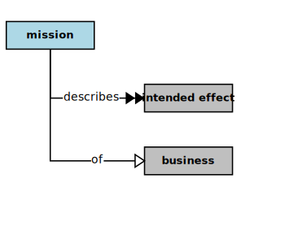

## Mission

<div  style="float: right; margin: 20px">

</div>

In the context of this [Model](model.md), a [Mission](mission.md)

```
<i>describes</i>  some intended effects of  a [business](business.md)
```

### Discussion


<h3 align="center"><b>&sect; &sect; &sect;</b></h3>
