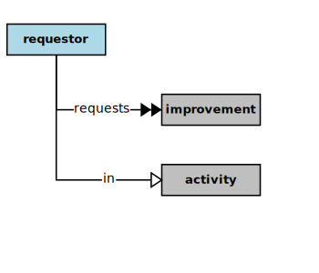

## Requestor

<div  style="float: right; margin: 20px">

</div>

In the context of this [Model](model.md), a [Requestor](requestor.md)

```
<i>requests</i>  some [improvements](improvement.md) in  an [activity](activity.md)
<i>oversees</i>  some [activities](activity.md) for  a [business](business.md)
<i>serves</i>  a [business](business.md) as  a [source](source.md) of  some [improvements](improvement.md),  some purposes
```

### Discussion

There are potentially several kinds of [requestors](requestor.md).
A [requestor](requestor.md) generally oversees and requests [improvements](improvement.md) in some [business](business.md) [activity](activity.md)(s),
or they may have specific domain knowledge and expertise.
They also ensure that the conduct of [business](business.md) [activities](activity.md) remain in alignment with the purposes of the [business](business.md),
esp. with its [mission](mission.md) and [vision](vision.md).


<h3 align="center"><b>&sect; &sect; &sect;</b></h3>
