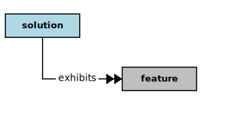

## Solution



In the context of this [Model](model.md), a [Solution](solution.md)

```
<i>exhibits</i>  some [features](feature.md)
<i>has</i>  some [components](component.md)
```

### Discussion


<h3 align="center"><b>&sect; &sect; &sect;</b></h3>
