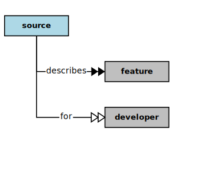

## Source



In the context of this [Model](model.md), a [Source](source.md)

```
<i>describes</i>  some [features](feature.md) for  some [developers](developer.md)
```

### Discussion


<h3 align="center"><b>&sect; &sect; &sect;</b></h3>
